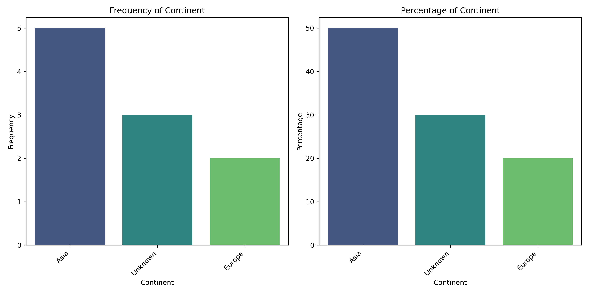
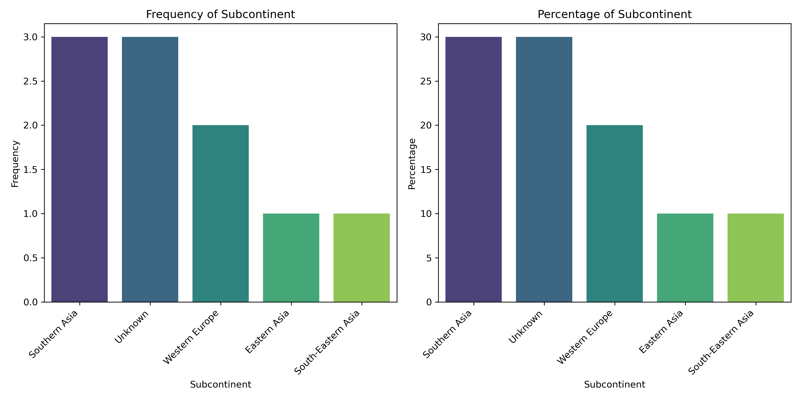
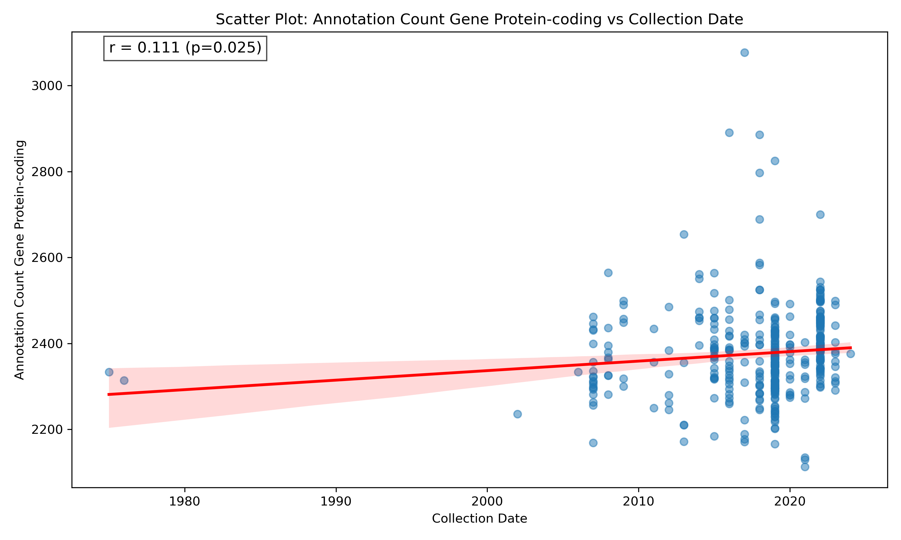
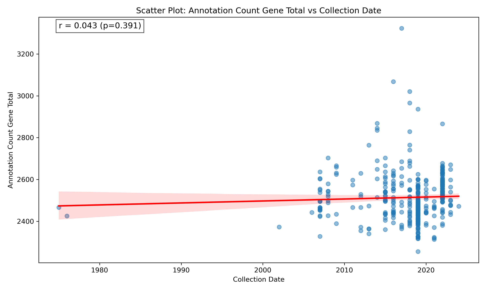
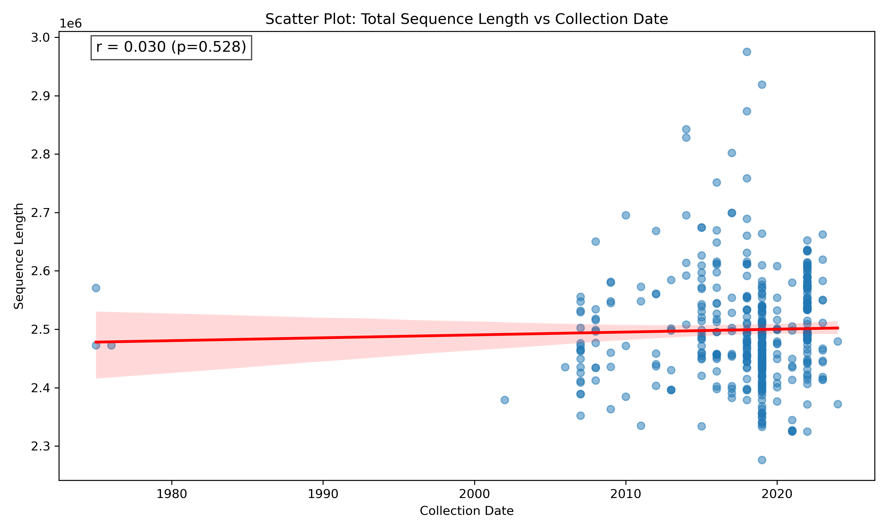

# fetchm: Metadata Fetching and Analysis Tool

## Overview
fetchm is a Python-based tool for fetching and analyzing genomic metadata from NCBI BioSample records. When you download ncbi_dataset.tsv from the NCBI genome database, the metadata fields such as 'Collection Date', 'Host', 'Geographic Location', and 'Isolation Source' are missing. This tool helps fetch the associated metadata for each BioSample ID. fetchm requires an input file (ncbi_dataset.tsv) from the NCBI genome database, retrieves additional annotations from NCBI, filters the data based on quality thresholds, and generates visualizations to help interpret the results. You can also download the filtered sequences. 

## Features
- Fetch metadata from NCBI BioSample API.
- Filter genomes based on CheckM completeness and ANI check status.
- Generate metadata summaries and annotation statistics.
- Create various visualizations for geographic distribution, collection dates, gene counts, continent, and subcontinent.
- Download genome sequences (optional).
- Download sequences after filtering by host species, year, country, continent, and subcontinent.

## Installation
### Install in a New Conda Environment 
```bash
conda create -n fetchm python=3.9
conda activate fetchm
pip install fetchm
```

## Usage
fetchm has three main modes:

1. Generate metadata summaries and `ncbi_clean.csv` from an NCBI dataset TSV:
```bash
fetchm metadata --input ncbi_dataset.tsv --outdir results/
```

2. Run the full workflow: metadata generation plus sequence download:
```bash
fetchm run --input ncbi_dataset.tsv --outdir results/
```

3. Download sequences later from an existing `ncbi_clean.csv`:
```bash
fetchm seq --input results/<organism>/metadata_output/ncbi_clean.csv --outdir results/<organism>/sequence
```

Common examples:

Download all metadata records regardless of ANI status:
```bash
fetchm metadata --input ncbi_dataset.tsv --outdir results/ --ani all
```

Run the full pipeline with a CheckM threshold:
```bash
fetchm run --input ncbi_dataset.tsv --outdir results/ --checkm 95
```

Download only sequences from human isolates collected between 2018 and 2024:
```bash
fetchm seq \
  --input results/<organism>/metadata_output/ncbi_clean.csv \
  --outdir results/<organism>/sequence \
  --host "Homo sapiens" \
  --year 2018-2024
```

Download only sequences from a specific country or continent:
```bash
fetchm seq --input ncbi_clean.csv --outdir sequence_output --country Bangladesh
fetchm seq --input ncbi_clean.csv --outdir sequence_output --cont Asia
```

Check download completeness without downloading anything:
```bash
fetchm seq --input ncbi_clean.csv --outdir sequence_output --check-only
```

Important notes:

- `fetchm run` already includes sequence downloading. You do not need to add `--seq` when using `fetchm run`.
- `--seq` is only relevant for the legacy `fetchM` command, where it controls whether sequence downloading happens after metadata generation.
- `fetchm seq` supports metadata-based sequence filters: `--host`, `--year`, `--country`, `--cont`, and `--subcont`.
- Metadata filtering options for `fetchm metadata` and `fetchm run` include `--ani`, `--checkm`, and `--sleep`.
- Sequence retry behavior can be adjusted with `--retries` and `--retry-delay`.

Legacy compatibility commands:
```bash
fetchM --input ncbi_dataset.tsv --outdir results/
fetchM --input ncbi_dataset.tsv --outdir results/ --seq
fetchM-seq --input ncbi_clean.csv --outdir sequence_output
```

### Test With `test.tsv`

Run a quick metadata-only smoke test:
```bash
fetchm metadata --input test.tsv --outdir test_output
```

Run the full pipeline, including sequence download:
```bash
fetchm run --input test.tsv --outdir test_output
```

Check downloaded sequence completeness from the generated `ncbi_clean.csv`:
```bash
fetchm seq \
  --input test_output/Staphylococcus_haemolyticus/metadata_output/ncbi_clean.csv \
  --outdir test_output/Staphylococcus_haemolyticus/sequence \
  --check-only
```

## Input
Download ncbi_dataset.tsv of your target organism(s) from the [NCBI genome database](https://www.ncbi.nlm.nih.gov/datasets/genome/).
-**ncbi_dataset.tsv**

# Required Columns for `ncbi_dataset.tsv` in fetchm

Before running `fetchm`, ensure that your `ncbi_dataset.tsv` file includes the following columns. These columns are necessary for metadata enrichment, quality filtering, and downstream analysis.

---

## 🧬 Required Columns

| Column Name                                | Description |
|--------------------------------------------|-------------|
| `Assembly Accession`                       | Unique identifier for the assembly |
| `Assembly Name`                            | Name of the genome assembly |
| `Organism Name`                            | Scientific name of the organism |
| `ANI Check status`                         | Status of Average Nucleotide Identity (ANI) check |
| `Annotation Name`                          | Annotation version or label used |
| `Assembly Stats Total Sequence Length`     | Total length (in base pairs) of all sequences in the assembly |
| `Assembly BioProject Accession`            | Accession ID for the related BioProject |
| `Assembly BioSample Accession`             | Accession ID for the related BioSample |
| `Annotation Count Gene Total`              | Total number of genes annotated |
| `Annotation Count Gene Protein-coding`     | Number of protein-coding genes |
| `Annotation Count Gene Pseudogene`         | Number of pseudogenes |
| `CheckM completeness`                      | Completeness score from CheckM (in %) |
| `CheckM contamination`                     | Contamination score from CheckM (in %) |

---

## ✅ Tips

- The file must be **tab-separated** (`.tsv` format).
- Don't change Column headers 
---

## Output
fetchm creates a subdirectory in `/results/` based on the organism name provided in the input file. Inside this subdirectory, the following folders are created:
- **Metadata summaries** in `metadata_output/`
  - `annotation_summary.csv`
  - `assembly_summary.csv`
  - `metadata_summary.csv`
  - `ncbi_clean.csv`
  - `ncbi_filtered.csv`
  - `ncbi_dataset_updated.tsv`
- **Figures** in `figures/`
  - `Annotation Count Gene Protein-coding_distribution.tiff`
  - `Annotation Count Gene Pseudogene_distribution.tiff`
  - `Annotation Count Gene Total_distribution.tiff`
  - `Assembly Stats Total Sequence Length_distribution.tiff`
  - `Collection Date_bar_plots.tiff`
  - `Continent_bar_plots.tiff`
  - `Geographic Location_bar_plots.tiff`
  - `Geographic Location_map.jpg`
  - `Host_bar_plots.tiff`
  - `scatter_plot_gene_protein_coding_vs_collection_date.tiff`
  - `scatter_plot_gene_total_vs_collection_date.tiff`
  - `scatter_plot_total_sequence_length_vs_collection_date.tiff`
  - `Subcontinent_bar_plots.tiff`
- **Sequences** in `sequence/` (if `--seq` is enabled, it will contain the downloaded genome sequences).


## Visualizations
### Annotation Distributions


### Assembly Statistics


### Metadata Summaries





### Scatter Plots




## License
This project is licensed under the MIT License.

## Author
Developed by Tasnimul Arabi Anik.

## Contributions
Contributions and improvements are welcome! Feel free to submit a pull request or report issues.
