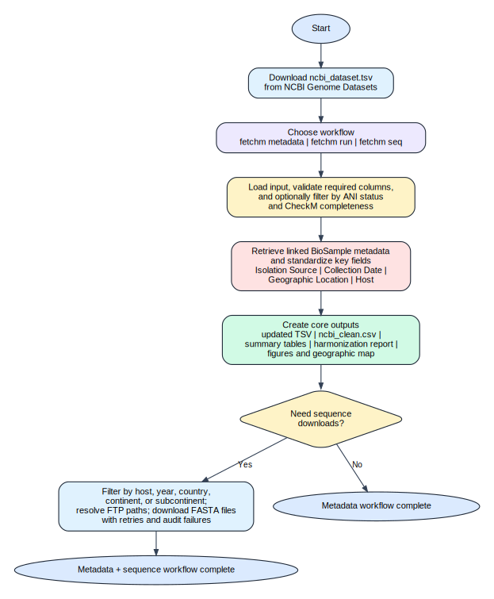
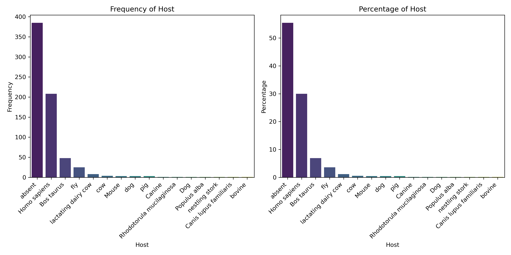

# fetchm: Metadata Fetching and Analysis Tool

## Overview
`fetchm` is a Python-based command-line tool for fetching and analyzing genomic metadata from NCBI BioSample records. When you download `ncbi_dataset.tsv` from the NCBI Genome database, important metadata fields such as `Collection Date`, `Host`, `Geographic Location`, and `Isolation Source` are often not included in the table export. `fetchm` uses the linked BioSample accession for each genome to retrieve those missing annotations from NCBI, standardize the results, filter the dataset by quality thresholds, and generate summary outputs and visualizations. You can also download genome sequences from the filtered dataset.

The tool is intended primarily for bacterial genomes. Metadata structures differ across organism groups, so non-bacterial datasets may not behave consistently.

## Workflow
The workflow diagram below gives a quick visual summary of how `fetchm` starts from an NCBI genome export, retrieves BioSample metadata, filters and summarizes the dataset, and optionally downloads sequences.



## Features
- Retrieve linked BioSample metadata fields including `Isolation Source`, `Collection Date`, `Geographic Location`, and `Host`.
- Start directly from the `ncbi_dataset.tsv` file exported from the NCBI Genome Datasets interface.
- Filter genomes by ANI status and minimum CheckM completeness threshold before downstream analysis.
- Standardize common missing-value strings and harmonize collection years, country names, continents, and subcontinents.
- Record metadata fetch status and reasons so unresolved rows can be reviewed and rerun cleanly.
- Cache previously resolved BioSample metadata in SQLite so repeated runs do not refetch the same records.
- Generate cleaned tables, metadata summaries, harmonization reports, failure reports, Markdown reports, DOCX reports, and figures.
- Download filtered genome FASTA files from NCBI after applying host, year, country, continent, or subcontinent filters.
- Audit an existing sequence directory with `--check-only` without downloading files again.
- Support both a metadata-only workflow and an all-in-one workflow that fetches metadata and downloads sequences in a single command.

## Installation
Create a fresh environment and install from PyPI:

```bash
conda create -n fetchm python=3.9
conda activate fetchm
pip install fetchm
```

`fetchm` uses Python dependencies only. No separate `wget` installation is required for the current release.

## NCBI API Key
For faster metadata retrieval, you can provide an NCBI API key. The usage section below also shows where to add it in the command line.

How to create one:

1. Sign in to your My NCBI account.
2. Open Account Settings.
3. Find `API Key Management`.
4. Create an API key.

Official NCBI references:

- https://www.ncbi.nlm.nih.gov/books/NBK25497/
- https://www.ncbi.nlm.nih.gov/books/NBK53593/
- https://www.ncbi.nlm.nih.gov/datasets/docs/v2/api/api-keys/

How `fetchm` uses request pacing:

- without an API key: default request delay is `0.34` seconds
- with an API key: default request delay is `0.15` seconds
- without an API key: default worker count is `3`
- with an API key: default worker count is `6`
- when NCBI returns `429 Too Many Requests`, `fetchm` increases the shared request interval automatically and gradually relaxes it again after stable success

`fetchm` keeps a persistent SQLite metadata cache inside each organism output directory so reruns do not need to refetch previously retrieved BioSample records. Confirmed non-transient outcomes such as successful fetches and source-missing records are cached, while transient fetch failures are retried on later runs. Sequence downloads also keep a small SQLite cache of resolved assembly directory paths inside the sequence output directory so reruns can skip repeated FTP path discovery.

You can pass the key directly:

```bash
fetchm metadata --input ncbi_dataset.tsv --outdir results/ --api-key YOUR_NCBI_API_KEY
```

Or use an environment variable:

```bash
export NCBI_API_KEY=YOUR_NCBI_API_KEY
fetchm metadata --input ncbi_dataset.tsv --outdir results/
```

Optional contact email:

```bash
fetchm metadata --input ncbi_dataset.tsv --outdir results/ --api-key YOUR_NCBI_API_KEY --email you@example.com
```

## Usage
### Recommended all-in-one workflow
The main entry point after installation is:

```bash
fetchm run --input ncbi_dataset.tsv --outdir results/
```

The current CLI uses `--outdir` as the output directory flag.

If you want to fetch metadata, generate reports and figures, and download all sequences without any additional filtering, use:

```bash
fetchm run --input ncbi_dataset.tsv --outdir results/
```

This command:

1. reads the NCBI genome export file
2. filters rows if you provide `--ani` and/or `--checkm`
3. fetches missing BioSample metadata from NCBI
4. writes cleaned tables and reports
5. generates figures
6. downloads FASTA files for the filtered dataset

If you want to make metadata fetching faster, use an NCBI API key:

```bash
fetchm run --input ncbi_dataset.tsv --outdir results/ --api-key YOUR_NCBI_API_KEY
```

You can also export the key once and reuse it across runs:

```bash
export NCBI_API_KEY=YOUR_NCBI_API_KEY
fetchm run --input ncbi_dataset.tsv --outdir results/
```

Instructions for creating an API key are listed in the [NCBI API Key](#ncbi-api-key) section above.

### Command overview
`fetchm` provides three main commands:

```bash
fetchm --help
fetchm metadata --help
fetchm run --help
fetchm seq --help
```

- `fetchm run`: recommended all-in-one workflow for metadata generation and sequence download
- `fetchm metadata`: metadata-only workflow, with optional sequence download support via `--seq`
- `fetchm seq`: sequence download workflow starting from an existing `ncbi_clean.csv`

### General usage patterns

```bash
fetchm run --input ncbi_dataset.tsv --outdir results/
fetchm metadata --input ncbi_dataset.tsv --outdir results/
fetchm seq --input results/<organism>/metadata_output/ncbi_clean.csv --outdir results/<organism>/sequence
```

### Common examples
If you only want to fetch metadata, clean the table, and generate reports and figures without downloading sequences, use:

```bash
fetchm metadata --input ncbi_dataset.tsv --outdir results/
```

If you want to rerun a previous metadata job and retry only unresolved rows, use:

```bash
fetchm metadata --input ncbi_dataset.tsv --outdir results/ --resume-metadata
```

If you want to keep only assemblies that pass a quality threshold before downstream analysis, use ANI and/or CheckM filtering:

```bash
fetchm run --input ncbi_dataset.tsv --outdir results/ --checkm 95
fetchm run --input ncbi_dataset.tsv --outdir results/ --ani OK
fetchm run --input ncbi_dataset.tsv --outdir results/ --ani OK --checkm 95
```

If you already have `ncbi_clean.csv` and only want to download sequences, use:

```bash
fetchm seq --input ncbi_clean.csv --outdir sequence_output
```

If you want to download only a subset of sequences based on metadata, you can filter by country, continent, host, year, or subcontinent:

```bash
fetchm seq --input ncbi_clean.csv --outdir sequence_output --country Bangladesh
fetchm seq --input ncbi_clean.csv --outdir sequence_output --cont Asia
```

If you want to check whether all expected sequence files are already present without downloading again, use:

```bash
fetchm seq --input ncbi_clean.csv --outdir sequence_output --check-only
```

### Sequence filtering examples
For example, if you want only human-associated genomes collected between 2018 and 2024 from Bangladesh, you can run:

```bash
fetchm run \
  --input ncbi_dataset.tsv \
  --outdir results/ \
  --host "Homo sapiens" \
  --year 2018-2024 \
  --country Bangladesh
```

```bash
fetchm seq \
  --input results/<organism>/metadata_output/ncbi_clean.csv \
  --outdir results/<organism>/sequence \
  --host "Homo sapiens" \
  --year 2018-2024 \
  --country Bangladesh
```

## Command Reference
### `fetchm run`
Recommended all-in-one command. `fetchm run` uses the same options as `fetchm metadata`, plus the sequence download filters and download settings shown below. In practice, this is the command most users will want.

```bash
fetchm run --help
```

Usage synopsis:

```bash
fetchm run --input INPUT --outdir OUTDIR [--sleep SLEEP] [--api-key API_KEY] \
  [--email EMAIL] [--workers WORKERS] \
  [--ani {OK,Inconclusive,Failed,all} [{OK,Inconclusive,Failed,all} ...]] \
  [--checkm CHECKM] [--resume-metadata] [--seq] \
  [--host HOST [HOST ...]] [--year YEAR [YEAR ...]] \
  [--country COUNTRY [COUNTRY ...]] [--cont CONT [CONT ...]] \
  [--subcont SUBCONT [SUBCONT ...]] [--retries RETRIES] \
  [--retry-delay RETRY_DELAY] [--check-only] \
  [--download-workers DOWNLOAD_WORKERS]
```

### `fetchm metadata`
Use this command when you want to retrieve metadata, create cleaned tables, and generate reports and figures without necessarily downloading sequences.

```bash
fetchm metadata --help
```

Usage synopsis:

```bash
fetchm metadata --input INPUT --outdir OUTDIR [--sleep SLEEP] [--api-key API_KEY] \
  [--email EMAIL] [--workers WORKERS] \
  [--ani {OK,Inconclusive,Failed,all} [{OK,Inconclusive,Failed,all} ...]] \
  [--checkm CHECKM] [--resume-metadata] [--seq] \
  [--host HOST [HOST ...]] [--year YEAR [YEAR ...]] \
  [--country COUNTRY [COUNTRY ...]] [--cont CONT [CONT ...]] \
  [--subcont SUBCONT [SUBCONT ...]] [--retries RETRIES] \
  [--retry-delay RETRY_DELAY] [--check-only] \
  [--download-workers DOWNLOAD_WORKERS]
```

`fetchm metadata` and `fetchm run` support the following options:

| Option | Description |
| --- | --- |
| `--input INPUT` | Path to the input TSV file exported from NCBI Genome Datasets. |
| `--outdir OUTDIR` | Path to the output directory where organism-specific results will be written. |
| `--sleep SLEEP` | Time to wait between NCBI requests. Default is `0.34` seconds without an API key and `0.15` seconds with an API key. |
| `--api-key API_KEY` | NCBI API key. If omitted, `fetchm` also checks the `NCBI_API_KEY` environment variable. |
| `--email EMAIL` | Contact email sent with NCBI E-utilities requests. |
| `--workers WORKERS` | Number of concurrent metadata fetch workers. Default is `3` without an API key and `6` with an API key. |
| `--ani {OK,Inconclusive,Failed,all}` | Filter genomes by ANI status. Default is `all`, meaning no ANI filtering. |
| `--checkm CHECKM` | Minimum CheckM completeness threshold. If not set, no CheckM filtering is applied. |
| `--resume-metadata` | Resume a previous metadata run from the existing `ncbi_dataset_updated.tsv` in the output directory and retry only unresolved rows. |
| `--seq` | With `fetchm metadata`, also trigger sequence downloading after metadata processing. `fetchm run` already includes sequence downloading by default. |
| `--host HOST [HOST ...]` | Filter sequence downloads by host species, for example `"Homo sapiens"`. |
| `--year YEAR [YEAR ...]` | Filter sequence downloads by year or year range, for example `"2015"` or `"2018-2025"`. |
| `--country COUNTRY [COUNTRY ...]` | Filter sequence downloads by country, for example `"Bangladesh"` or `"United States"`. |
| `--cont CONT [CONT ...]` | Filter sequence downloads by continent, for example `"Asia"` or `"Africa"`. |
| `--subcont SUBCONT [SUBCONT ...]` | Filter sequence downloads by subcontinent, for example `"Southern Asia"`. |
| `--retries RETRIES` | Retry attempts per genome download. Default is `3`. |
| `--retry-delay RETRY_DELAY` | Base delay in seconds before retrying a failed download. Default is `5.0`. |
| `--check-only` | Audit the output directory against the expected sequence set without downloading new files. |
| `--download-workers DOWNLOAD_WORKERS` | Number of concurrent genome download workers. Default is `4`. |

### `fetchm seq`
Use this command when you already have an `ncbi_clean.csv` file and only want sequence download or audit behavior.

```bash
fetchm seq --help
```

Usage synopsis:

```bash
fetchm seq --input INPUT --outdir OUTDIR [--host HOST [HOST ...]] \
  [--year YEAR [YEAR ...]] [--country COUNTRY [COUNTRY ...]] \
  [--cont CONT [CONT ...]] [--subcont SUBCONT [SUBCONT ...]] \
  [--retries RETRIES] [--retry-delay RETRY_DELAY] \
  [--check-only] [--download-workers DOWNLOAD_WORKERS]
```

`fetchm seq` supports the following options:

| Option | Description |
| --- | --- |
| `--input INPUT` | Path to `ncbi_clean.csv`. |
| `--outdir OUTDIR` | Directory where FASTA files will be written. |
| `--host HOST [HOST ...]` | Filter by host species. |
| `--year YEAR [YEAR ...]` | Filter by year or year range. |
| `--country COUNTRY [COUNTRY ...]` | Filter by country. |
| `--cont CONT [CONT ...]` | Filter by continent. |
| `--subcont SUBCONT [SUBCONT ...]` | Filter by subcontinent. |
| `--retries RETRIES` | Retry attempts per genome download. Default is `3`. |
| `--retry-delay RETRY_DELAY` | Base delay in seconds before retrying a failed download. Default is `5.0`. |
| `--check-only` | Audit the output directory against the input CSV without downloading. |
| `--download-workers DOWNLOAD_WORKERS` | Concurrent genome download workers. Default is `4`. |

### Legacy compatibility commands
These older entry points are still available:

```bash
fetchM --input ncbi_dataset.tsv --outdir results/
fetchM --input ncbi_dataset.tsv --outdir results/ --seq
fetchM-seq --input ncbi_clean.csv --outdir sequence_output
```

## Demo Files
Example inputs and figure assets are already bundled in the repository:

- `test.tsv`: quick smoke-test dataset
- `vibrio_v2.tsv`: larger example dataset
- [`figures/`](figures/): workflow diagram and example output figures

Quick smoke test:

```bash
fetchm metadata --input test.tsv --outdir test_output
```

## Input Requirements
Download `ncbi_dataset.tsv` from the [NCBI Genome Datasets interface](https://www.ncbi.nlm.nih.gov/datasets/genome/).

If you are unsure which export options to pick, selecting all available columns in the NCBI table export is the safest route.

Required columns:

| Column Name | Description |
| --- | --- |
| `Assembly Accession` | Unique identifier for the assembly |
| `Assembly Name` | Name of the genome assembly |
| `Organism Name` | Scientific name of the organism |
| `ANI Check status` | ANI validation status from NCBI |
| `Annotation Name` | Annotation pipeline name |
| `Assembly Stats Total Sequence Length` | Total sequence length |
| `Assembly BioProject Accession` | Linked BioProject accession |
| `Assembly BioSample Accession` | Linked BioSample accession |
| `Annotation Count Gene Total` | Total annotated genes |
| `Annotation Count Gene Protein-coding` | Protein-coding genes |
| `Annotation Count Gene Pseudogene` | Pseudogenes |
| `CheckM completeness` | CheckM completeness value |
| `CheckM contamination` | CheckM contamination value |

Important notes:

- the file must be tab-separated
- keep the original header names unchanged
- ANI filtering is disabled by default unless you provide `--ani`
- CheckM filtering is disabled by default unless you provide `--checkm`

## Output
For each run, `fetchm` creates an organism-specific result directory containing:

- `metadata_output/ncbi_dataset_updated.tsv`
- `metadata_output/ncbi_clean.csv`
- `metadata_output/metadata_summary.csv`
- `metadata_output/assembly_summary.csv`
- `metadata_output/annotation_summary.csv`
- `metadata_output/metadata_harmonization_report.csv`
- `metadata_output/metadata_fetch_failures.csv`
- `metadata_output/fetchm_report.md`
- `metadata_output/fetchm_report.docx`
- `figures/*.png`
- `figures/*.tiff`
- `figures/Geographic Location_map.jpg` or `figures/Geographic Location_map.html` when static map export is unavailable
- `sequence/*.fna` when sequence downloading is enabled
- `sequence/failed_accessions.txt` after sequence audit or download

The harmonization report gives a quick completeness summary for the standardized metadata fields. The comprehensive reports summarize runtime, filters, metadata completeness, key observations, numeric summaries, generated outputs, and fetch-failure reasons. Metadata fetching uses the BioSample E-utilities XML route first and falls back to the NCBI BioSample summary payload when the primary record is incomplete or resolves to the wrong accession.

Missing metadata semantics:

- `unknown`: the source metadata explicitly used a missing or unknown-style value such as `NA`, `missing`, or `unknown`
- `absent`: `fetchm` could not retrieve or locate a usable value for that field from the linked metadata
- `Metadata Fetch Status`: values include `ok`, `cached`, `source_missing`, `not_found`, and `fetch_failed`

Additional metadata notes:

- geographic labels such as `Taiwan`, `Hong Kong`, `Guam`, and `Republic of the Congo` are normalized for continent and subcontinent assignment
- isolation-source classification is conservative: rows with source-like attributes but missing-style values are treated as `unknown`, while broad source absence remains `absent`
- static geographic map export uses Kaleido when available; on headless systems without a compatible static export backend, `fetchm` writes an interactive HTML map and continues instead of requiring Google Chrome

## Example Figures
The repository includes example figure files that can be linked directly from the `figures/` directory:

- [Host bar plots](figures/Host_bar_plots.png)
- [Collection date bar plots](figures/Collection%20Date_bar_plots.png)
- [Continent bar plots](figures/Continent_bar_plots.png)
- [Subcontinent bar plots](figures/Subcontinent_bar_plots.png)
- [Geographic location bar plots](figures/Geographic%20Location_bar_plots.png)
- [Geographic location map](figures/Geographic%20Location_map.jpg)
- [Sequence length scatter plot](figures/scatter_plot_Sequence_Length_vs_collection_date.png)
- [Protein-coding gene scatter plot](figures/scatter_plot_gene_protein_coding_vs_collection_date.png)

Example previews:




## Notes
- `fetchm run` already includes sequence downloading.
- `fetchm metadata` can optionally download sequences when `--seq` is supplied.
- scatter plots are skipped automatically when the filtered dataset does not contain enough valid points.
- successful runs report total runtime together with the number of NCBI input rows processed.
- runtime depends strongly on dataset size, NCBI responsiveness, and network conditions.

## License
MIT License.

## Author
Tasnimul Arabi Anik
